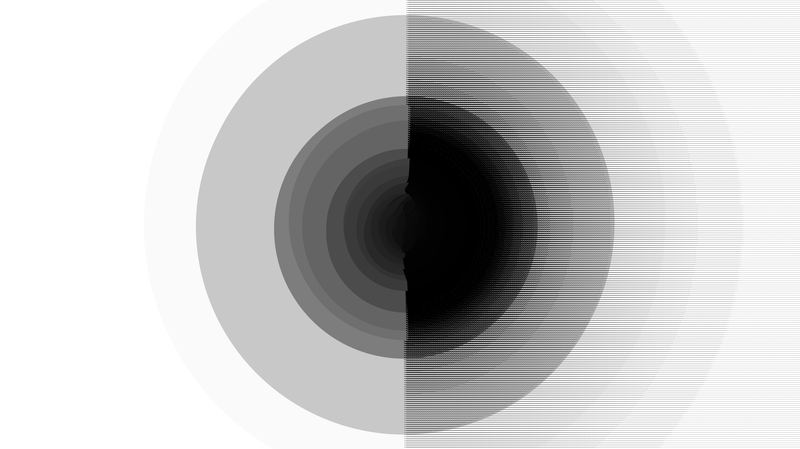
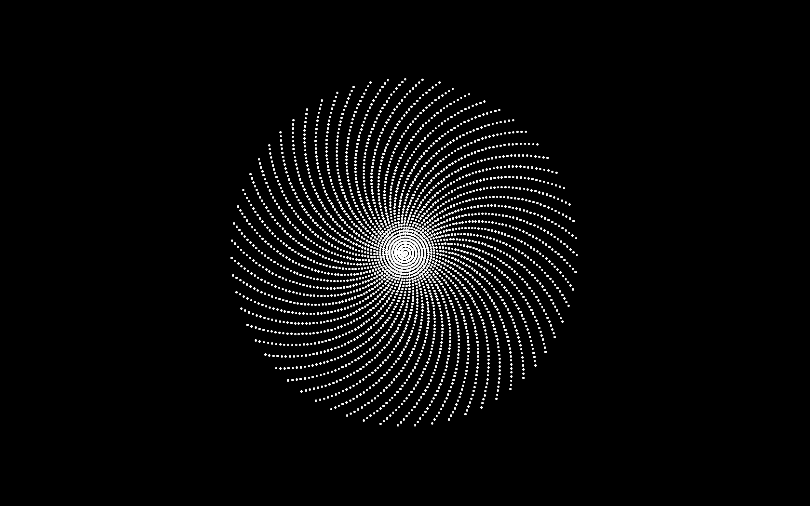
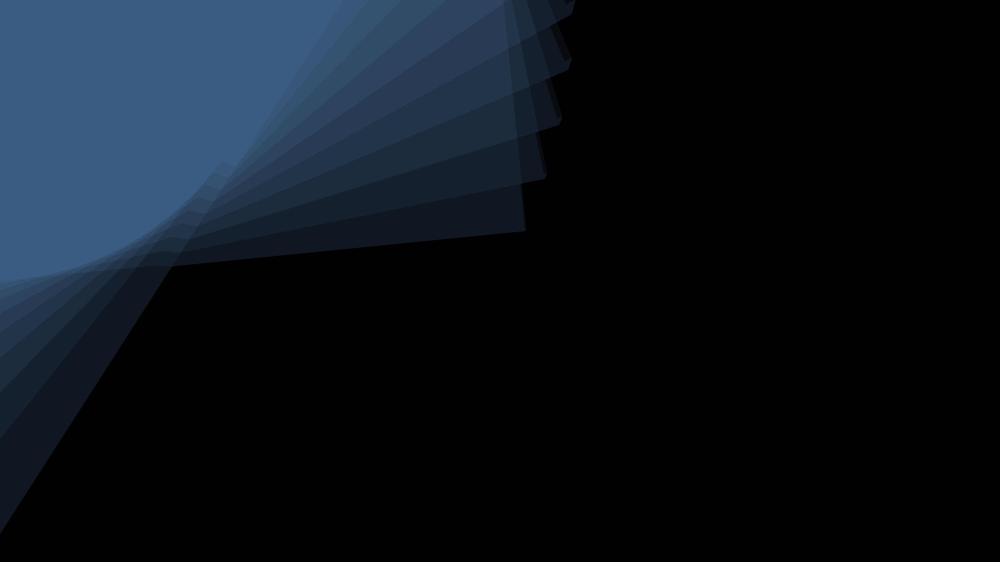

# processing-playground

hello, so when I'm bored and have a computer in front of me, I tend to do weird programming stuff and ask myself weird questions (mostly in university lectures). What if I combine that mathematical concept with this wild graphic plot type? This repo contains all the trash that comes out.

## Gallery

(see my google photos for more: )

